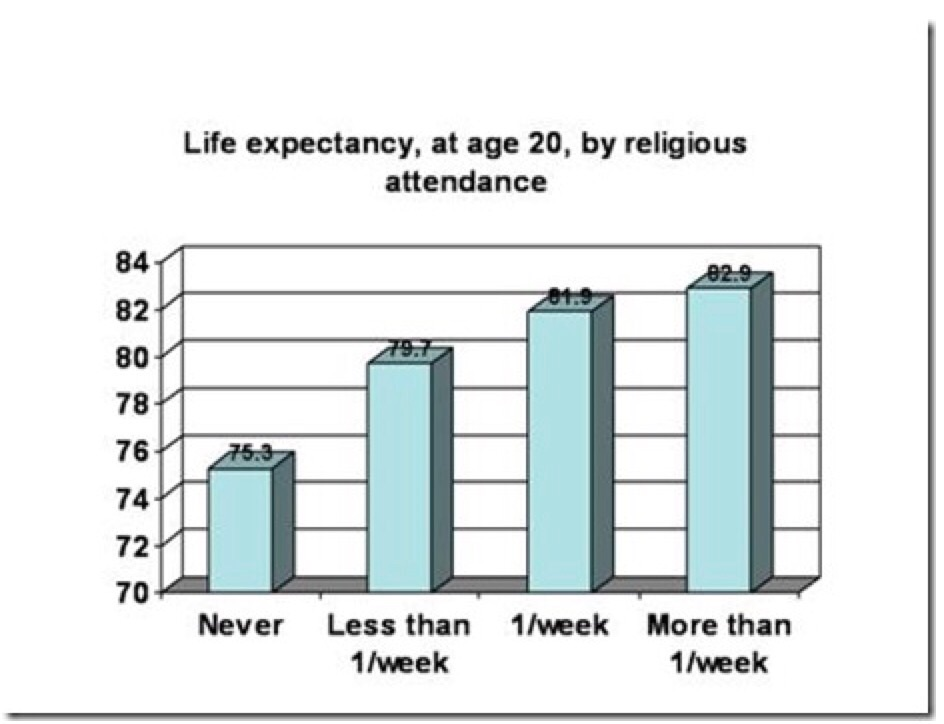

# 关于信仰

讲述利益攸关视角下的信仰认识。

其实是宗教谈起。

## 帕斯卡的赌博

到底要不要信教，要不要信上帝，帕斯卡用他的数学期望模型做了解释。

帕斯卡说，上帝到底存不存在，这我们不知道 —— 但是我们可以假设上帝有50%的可能性存在。那么在这种情况下，我应该怎么办？我应该就当上帝存在，我应该信教。这是因为如果上帝真的存在，我按照上帝要求的去做，牺牲一些世俗的享受，去过一种虔诚的生活，那我将来就能上天堂啊，我得到的好处就是无穷大。如果上帝不存在，我这么做无非就是牺牲了一点世俗的享受。所以：

```
我信教的数学期望 = 无穷大 × 50% — 一点世俗的享受 × 50%
```

结果等于无穷大。

也就是说，哪怕上帝不一定存在，因为他一旦存在的好处实在太大，你也应该赌他存在。这就叫“帕斯卡的赌博”。

发展到现代，帕斯卡的赌博就变成了不管是哪个庙，我都要进来烧个香。不管用，我不过是损失一点点钱而已；万一管用，回报就是巨大的。这是一种“宁可信其有”的投机心态。

这显然不够理性。

## 理性

宗教给严肃对待它的人提供了一个“理性”的生活方式。

现在“非理性”是个非常流行的词。有些人认为相信虚幻的东西就是非理性，这在我们专栏的读者看来肯定是站不住脚的 —— 因为我们知道，人们平时看到的很多东西都是虚幻的。人的眼睛就有很多错觉，我们主观视角看到的并不是真实世界，那你能说这就是非理性吗？

塔勒布举了一个例子。古罗马和古希腊人在建筑庙宇的时候，会故意把大殿的柱子向内倾斜一点，不是绝对垂直的 —— 而这样一来，给人视觉上的感觉反而更直。这是一个错觉，可是你能说这是非理性吗？

什么是真正的非理性？按照塔勒布的标准，如果一个东西对你的生存构成威胁，你还相信它，这就叫非理性。但如果你信的东西有利于你的生存，那就算它是不真实的，也可以说是理性。

我来举个中国人熟悉的例子。佛教中有一条戒律说僧人在野外喝水不能直接把河里的水拿来就喝，必须先用布把水过滤一遍。还有一句话叫“佛观一碗水，八万四千虫”。这是一个信仰，它的底层原理古人理解的肯定不对，但是它能让人喝到比较干净的水。你要是遵循这条戒律，你的生存机会就会提高，那你就是理性的。

这才是宗教的价值。因为信教，你的生活方式比较健康，你的生存几率比较大。

事实上，我就多次看到有研究统计，信教者的平均寿命和健康状况都比不信教的人高。

经常参加宗教活动的人，平均预期寿命更长：



这大概就是因为宗教不仅仅是一个信仰，它还提供了一个健康的生活方式。真正信教的人不能太放纵，不能整天喝酒无度或酒后闹事。

## 相信

**信什么、信到什么程度其实不重要。可是要想真的从中得到好处，你得严肃对待信仰。哪怕是错误的知识，只要能让你更好地活下去，能提高你的生存几率，就是理性的，就比什么都不信要强。**

> from 精英日课2 - 119